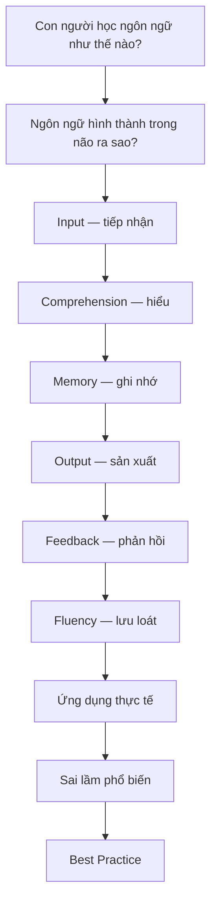

> Bộ tài liệu về bản chất của ngôn ngữ và cách bộ não tiếp thu ngôn ngữ thứ hai — dành cho người trưởng thành tự học.

---

## Tài liệu này dành cho ai?

- Người mới bắt đầu hoặc **mất gốc**, học lại từ đầu.
- Người đã học tiếng Anh nhiều năm nhưng **không giao tiếp được**.
- Người **tự học**, không có giáo viên.
- **Lập trình viên** và người đi làm cần đọc tài liệu, họp, phỏng vấn bằng tiếng Anh.

## Tài liệu này KHÔNG phải là gì?

- Không phải sách ngữ pháp. Không có "12 thì".
- Không phải danh sách 3000 từ vựng.
- Không hứa "giỏi tiếng Anh trong 3 tháng".

Thay vào đó, tài liệu trả lời câu hỏi gốc: **con người học ngôn ngữ như thế nào** — và từ đó, bạn tự thiết kế được cách học phù hợp với chính mình.

## Triết lý xuyên suốt

Mọi chương đều đi theo một chuỗi nhân quả duy nhất:

Nếu bạn chỉ nhớ một điều từ toàn bộ tài liệu, hãy nhớ chuỗi này. Mọi phương pháp học — dù tên gọi hoa mỹ đến đâu — đều chỉ là cách tác động vào một hoặc vài mắt xích trong chuỗi trên. Phương pháp tốt là phương pháp tác động đúng mắt xích bạn đang yếu.

## Mục lục

### Phần I — Nền tảng

| Chương | Nội dung | Câu hỏi trung tâm |
|---|---|---|
| [01. Ngôn ngữ là gì?](/handbook/01-ngon-ngu-la-gi) | Bản chất ngôn ngữ, tiếng mẹ đẻ vs ngoại ngữ, trẻ em vs người lớn | Ta đang học *cái gì*? |
| [02. Bộ não học ngoại ngữ](/handbook/02-bo-nao-hoc-ngoai-ngu) | Working Memory, Long-term Memory, Active Recall, Spaced Repetition, Chunking, Cognitive Load, Automaticity | Bộ máy học hoạt động ra sao? |
| [03. Mô hình tổng thể](/handbook/03-mo-hinh-tong-the) | Input → Comprehension → Memory → Output → Feedback → Fluency | Các mảnh ghép nối với nhau thế nào? |

### Phần II — Kỹ năng

| Chương | Nội dung |
|---|---|
| [04. Bốn kỹ năng](/handbook/04-bon-ky-nang) | Listening, Speaking, Reading, Writing hỗ trợ nhau ra sao; ưu tiên gì ở từng giai đoạn |
| [05. Pronunciation](/handbook/05-pronunciation) | IPA, Phoneme, Stress, Rhythm, Intonation, Connected Speech — vì sao phát âm đúng giúp *nghe* tốt hơn |
| [06. Grammar](/handbook/06-grammar) | Grammar tồn tại để làm gì; khi nào cần và không cần tập trung vào grammar |
| [07. Vocabulary](/handbook/07-vocabulary) | Word Family, Collocation, Chunk, Frequency, Context, Polysemy |
| [08. Listening](/handbook/08-listening) | Comprehensible Input, Extensive/Intensive Listening, Shadowing, Dictation |
| [09. Speaking](/handbook/09-speaking) | Fluency vs Accuracy, Output Hypothesis, Self-talk, Conversation Practice |
| [10. Reading](/handbook/10-reading) | Extensive/Intensive Reading, Graded Readers, Reading Strategy |
| [11. Writing](/handbook/11-writing) | Sentence → Paragraph, Feedback, Revision, Error Analysis |

### Phần III — Ứng dụng

| Chương | Nội dung |
|---|---|
| [12. Thiết kế lộ trình học](/handbook/12-lo-trinh-hoc) | Lộ trình mẫu: người mất gốc, người cần giao tiếp, lập trình viên, người chuẩn bị phỏng vấn, người luyện IELTS |
| [13. Sai lầm phổ biến](/handbook/13-sai-lam-pho-bien) | 7 sai lầm lớn: nguyên nhân — hậu quả — cách khắc phục |
| [14. Tình huống thực tế](/handbook/14-tinh-huong-thuc-te) | 30 phút/ngày, đi làm full-time, tự học, phỏng vấn, podcast, tài liệu kỹ thuật |
| [15. Tổng kết & Best Practices](/handbook/15-tong-ket) | Những nguyên lý cần nhớ và cách duy trì lâu dài |

## Cách dùng bộ tài liệu

1. **Đọc lần đầu:** đọc tuần tự chương 01 → 03. Đây là nền móng; mọi chương sau đều tham chiếu về đây.
2. **Đọc theo nhu cầu:** sau phần I, bạn có thể nhảy thẳng đến kỹ năng mình yếu nhất (phần II) hoặc lộ trình phù hợp (chương 12).
3. **Làm bài tập:** mỗi chương có bài tập minh họa. Đọc mà không làm thì kiến thức chỉ nằm ở Working Memory — nó sẽ biến mất (xem chương 02 để hiểu vì sao).
4. **Quay lại định kỳ:** chính tài liệu này cũng nên được đọc theo Spaced Repetition — đọc lại chương 13 sau 1 tháng học, bạn sẽ nhận ra những sai lầm mình đang mắc mà lần đọc đầu không thấy.

## Quy ước thuật ngữ

Các thuật ngữ khoa học được **giữ nguyên tiếng Anh** kèm giải thích tiếng Việt ở lần xuất hiện đầu: Input, Output, Comprehensible Input, Working Memory, Long-term Memory, Active Recall, Spaced Repetition, Chunking, Cognitive Load, Automaticity, Phoneme, IPA, Shadowing, Collocation, Fluency, Accuracy...

Lý do: đây là các khái niệm có định nghĩa kỹ thuật chính xác trong ngành. Giữ nguyên tiếng Anh giúp bạn tra cứu thêm tài liệu gốc và tránh dịch sai lệch nghĩa.

## Cơ sở khoa học

Nội dung dựa trên tinh thần các nghiên cứu chính trong Second Language Acquisition (SLA) và khoa học nhận thức, trong đó có: Input Hypothesis (Krashen), Output Hypothesis (Swain), Noticing Hypothesis (Schmidt), Interaction Hypothesis (Long), Skill Acquisition Theory (DeKeyser), mô hình Working Memory (Baddeley), đường cong quên lãng (Ebbinghaus), Cognitive Load Theory (Sweller), nghiên cứu từ vựng của Paul Nation, và Usage-based Theory (Tomasello). Tài liệu trình bày *tinh thần* của các lý thuyết này, không phải bản dịch học thuật; và quan trọng hơn — trình bày cả **giới hạn** của từng lý thuyết, vì không có lý thuyết nào đúng trong mọi hoàn cảnh.

---

*Bắt đầu với [Chương 01 — Ngôn ngữ là gì?](/handbook/01-ngon-ngu-la-gi)*
