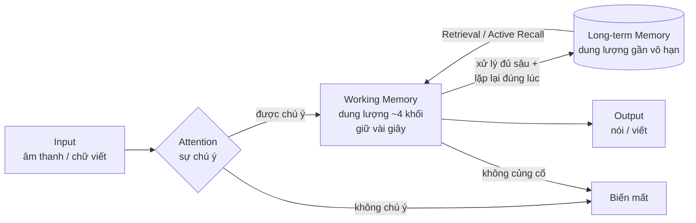
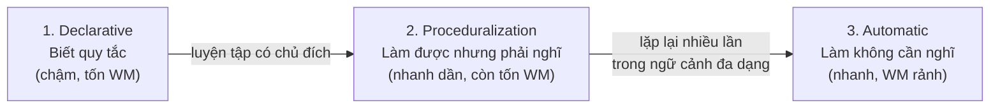

> Bạn không thể tối ưu một hệ thống mà bạn không hiểu. Chương này mô tả "phần cứng" và "hệ điều hành" của việc học: trí nhớ, sự chú ý, và quá trình tự động hóa.

---

## 1. Bài toán người học đang gặp

Ba lời than phổ biến nhất của người học tiếng Anh trưởng thành:

- *"Học từ nào quên từ đó."*
- *"Nghe thì hiểu lõm bõm, nhưng người ta nói nhanh là não 'đơ' luôn."*
- *"Biết hết từ, biết hết ngữ pháp, mà ghép thành câu thì chậm như rùa."*

Cả ba đều không phải vấn đề ý chí hay năng khiếu. Chúng là hệ quả trực tiếp của ba cơ chế não bộ: **đường cong quên lãng**, **giới hạn của Working Memory**, và **sự thiếu vắng Automaticity**. Hiểu ba cơ chế này, bạn sẽ thấy giải pháp gần như tự hiện ra.

## 2. Vì sao? — Kiến trúc trí nhớ và học tập

### Sơ đồ tổng thể



### Working Memory — nút cổ chai của mọi thứ

**Working Memory** (trí nhớ làm việc, mô hình Baddeley) là "bàn làm việc" của não: nơi giữ và xử lý thông tin *đang dùng ngay lúc này*. Đặc điểm quyết định: nó **cực kỳ nhỏ** — chỉ giữ được khoảng 4 (±1) khối thông tin trong vài giây.

Đây chính là lời giải cho hiện tượng "não đơ khi nghe": khi nghe câu *"What I was trying to say is that we should probably reconsider the timeline"*, nếu bạn phải xử lý từng từ một (mỗi từ = 1 khối), Working Memory tràn ngay ở từ thứ 5 — phần sau của câu đến, phần đầu đã bị đẩy rơi khỏi bàn. Bạn "nghe được từng từ mà không hiểu cả câu" là vì vậy.

Người bản xứ nghe câu đó không xử lý 13 từ — họ xử lý khoảng 3 khối: *[What I was trying to say is] [we should probably] [reconsider the timeline]*. Cùng một Working Memory 4 khối, nhưng mỗi khối của họ to hơn nhiều. Đó là nhờ **Chunking**.

### Chunking — nén nhiều thành một

**Chunking** là cơ chế não gộp nhiều đơn vị nhỏ thành một khối duy nhất trong trí nhớ. Số điện thoại `0912345678` khó nhớ như 10 chữ số rời, dễ nhớ như 3 khối `091-234-5678`. Với ngôn ngữ, chunk là các cụm được dùng cùng nhau thường xuyên đến mức não lưu chúng **như một từ duy nhất**: *as a matter of fact*, *I was wondering if*, *it turns out that*.

Hệ quả chiến lược quan trọng bậc nhất của toàn bộ tài liệu này: **trình độ ngôn ngữ, xét về mặt nhận thức, phần lớn là kích thước kho chunk.** Người "giỏi tiếng Anh" không phải người có Working Memory to hơn — mà là người đã nén được hàng chục nghìn tổ hợp từ thành các khối có sẵn, nên bàn làm việc của họ không bao giờ tràn. Điều này sẽ được khai triển ở chương 07 (Vocabulary).

### Long-term Memory và đường cong quên lãng

**Long-term Memory** (trí nhớ dài hạn) có dung lượng gần như vô hạn, nhưng cửa vào rất hẹp. Nghiên cứu kinh điển của Ebbinghaus chỉ ra **đường cong quên lãng**: thông tin mới học mất đi rất nhanh — phần lớn biến mất trong 24–48 giờ đầu — nếu không được kích hoạt lại.

```
Mức nhớ
100% ●
     │●
 80% │ ●        ● = không ôn tập
     │  ●
 60% │   ●●
     │     ●●●
 40% │        ●●●●
     │            ●●●●●●
 20% │                  ●●●●●●●●●●
     └──────────────────────────────► Thời gian
      1h   1 ngày   1 tuần    1 tháng
```

"Học từ nào quên từ đó" không phải lỗi của bạn — đó là **hành vi mặc định** của não với thông tin không được củng cố. Não quên có chủ đích: nó xóa những gì không được dùng lại để tiết kiệm tài nguyên. Muốn não giữ, phải gửi tín hiệu "cái này được dùng" — bằng hai công cụ dưới đây.

### Active Recall — nhớ ra, đừng nhìn lại

**Active Recall** (chủ động truy xuất) là hành động **cố nhớ ra** thông tin thay vì đọc lại nó. Nghiên cứu về "testing effect" (Roediger & Karpicke) cho kết quả nhất quán: tự kiểm tra tạo trí nhớ bền hơn hẳn so với đọc lại, dù đọc lại *cảm giác* dễ chịu và trôi chảy hơn.

Cơ chế: mỗi lần não phải vất vả lục tìm và truy xuất thành công một ký ức, đường truyền thần kinh đến ký ức đó được củng cố. Đọc lại không tạo ra sự vất vả đó — nó chỉ tạo **ảo giác quen thuộc**: "à, cái này mình biết rồi" (nhận ra được ≠ nhớ ra được). Đây là lý do bạn highlight cả quyển sổ từ vựng mà vẫn không dùng được từ nào.

### Spaced Repetition — ôn đúng lúc sắp quên

**Spaced Repetition** (lặp lại ngắt quãng) trả lời câu hỏi "ôn *khi nào*": thời điểm ôn hiệu quả nhất là **ngay trước khi bạn quên**. Mỗi lần truy xuất thành công ở đúng ranh giới sắp quên, đường cong quên lãng của thông tin đó thoải ra — lần sau bạn có thể đợi lâu hơn mới cần ôn: 1 ngày → 3 ngày → 1 tuần → 1 tháng → 6 tháng.

```
Mức nhớ
100% ●     ●ôn        ●ôn           ●ôn
     │●    ↑│●        ↑ │●●         ↑  │●●●
     │ ●   ││ ●●      │ │  ●●●      │  │   ●●●●
     │  ●  ││   ●●    │ │     ●●●   │  │       ●●●●●
     │   ● ││     ●●  │ │        ●● │  │
     └──────┴─────────┴─────────────┴──────────► Thời gian
       ngày 1   ngày 3      ngày 7       ngày 21
       (khoảng cách giữa các lần ôn tăng dần)
```

Kết hợp Active Recall + Spaced Repetition chính là nguyên lý đằng sau các app flashcard như Anki. Lưu ý: app chỉ là công cụ; nguyên lý mới là thứ quan trọng — bạn có thể thực hiện nó bằng sổ tay, bằng cách kể lại cho người khác, hay bằng việc dùng từ đó trong câu nói của mình.

### Cognitive Load — ngân sách chú ý có hạn

**Cognitive Load** (tải nhận thức, lý thuyết Sweller) là tổng lượng xử lý đang đè lên Working Memory. Khi tải vượt trần, việc học **dừng hẳn** — không phải chậm lại, mà dừng. Ba nguồn tải:

| Loại tải | Nguồn gốc | Ví dụ khi học tiếng Anh | Nên làm gì |
|---|---|---|---|
| Intrinsic (nội tại) | Độ khó bản thân tài liệu | Nghe đoạn có 40% từ mới | **Điều chỉnh** — chọn tài liệu vừa sức |
| Extraneous (ngoại lai) | Cách trình bày, môi trường | Vừa nghe vừa nhìn subtitle Việt vừa tra từ điển | **Loại bỏ** — mỗi lúc một việc |
| Germane (hữu ích) | Nỗ lực xây dựng quy luật | Cố nhận ra pattern trong các câu ví dụ | **Tối đa hóa** |

Đây là cơ sở khoa học của khái niệm "tài liệu vừa sức" (Comprehensible Input, chương 08): tài liệu quá khó không phải "thử thách tốt" — nó là tải nội tại vượt trần, và não không học được gì từ nó.

### Automaticity — từ biết đến không cần nghĩ

**Automaticity** (tính tự động) là trạng thái kỹ năng chạy mà không tốn Working Memory. Theo Skill Acquisition Theory (DeKeyser, dựa trên mô hình ACT-R của Anderson), kỹ năng đi qua ba pha:



Giống lái xe: ban đầu bạn *nghĩ* về côn-số-ga (declarative, kiệt sức sau 30 phút); sau vài tháng, tay chân tự làm còn đầu óc rảnh để nói chuyện (automatic). "Biết hết ngữ pháp mà nói chậm như rùa" nghĩa là kiến thức của bạn đang kẹt ở pha 1 — và **cách duy nhất sang pha 3 là số lượng lớn lần sử dụng thật**, không phải học thêm quy tắc. Không có đường tắt; chỉ có luyện tập được thiết kế tốt hơn hoặc tệ hơn.

## 3. Giải pháp hiện tại có hạn chế gì?

Cách học phổ biến vi phạm gần như mọi cơ chế trên: chép từ 10 lần (không phải Active Recall — tay hoạt động, não thụ động), học dồn 3 tiếng trước kỳ thi (ngược với Spaced Repetition — nhớ để thi, quên sau thi), học danh sách từ đơn lẻ (không tạo chunk), chọn tài liệu quá khó "cho nhanh giỏi" (vượt Cognitive Load), và học quy tắc mãi không dùng (kẹt ở pha declarative).

## 4. Nguyên lý cốt lõi

1. **Working Memory nhỏ cố định — chiến lược duy nhất là làm khối to lên (Chunking).**
2. **Quên là mặc định. Nhớ phải được thiết kế** — bằng Active Recall đặt đúng lịch Spaced Repetition.
3. **Vất vả đúng chỗ là tín hiệu học** ("desirable difficulty"): cảm giác trôi chảy dễ chịu khi ôn thường là ảo giác; cảm giác cố gắng nhớ ra là học thật.
4. **Tự động hóa chỉ đến từ tần suất sử dụng**, không đến từ hiểu sâu thêm.

## 5. Cách áp dụng từng bước

1. **Chuyển mọi hoạt động ôn tập sang Active Recall:** che nghĩa và nhớ ra; kể lại nội dung vừa nghe; tự đặt câu với từ mới trước khi xem ví dụ mẫu.
2. **Dựng một hệ Spaced Repetition:** đơn giản nhất là dùng Anki/flashcard app; hoặc quy tắc sổ tay "ôn ngày 1 – 3 – 7 – 21".
3. **Học theo chunk ngay từ đầu:** thẻ flashcard ghi *"make a decision"* thay vì *"decision = quyết định"*.
4. **Quản lý Cognitive Load:** chọn tài liệu hiểu ~90%+; mỗi hoạt động chỉ một mục tiêu (nghe để hiểu ý HOẶC nghe để bắt âm — không cả hai cùng lúc).
5. **Dành tỉ lệ lớn thời gian cho sử dụng, không phải tiếp thu kiến thức mới:** quy tắc thô: 1 phần học mới, 3 phần dùng lại (nghe, nói, đọc, viết với những gì đã học).

## 6. Ví dụ minh họa

Minh học từ **"stubborn"** (bướng bỉnh) theo hai cách:

- **Cách cũ:** chép "stubborn = bướng bỉnh" 10 lần vào sổ. Tối đọc lại danh sách 50 từ. Cảm giác: "ổn, quen mặt hết rồi." Ba tuần sau gặp lại trong bài đọc: ngờ ngợ, không nhớ nghĩa. Cần dùng khi nói: không bao giờ bật ra.
- **Cách theo cơ chế não:** tạo thẻ *"He's too ______ to say sorry" → stubborn*, kèm audio phát âm. Ngày 1 nhớ ra được (vất vả một chút — tốt). Ôn ngày 3, 7, 21 — mỗi lần chỉ 10 giây. Tuần 2, chủ động dùng nó khi self-talk: *"I was too stubborn to ask for help."* Ba tháng sau từ này bật ra tự động khi cần.

Tổng thời gian cách hai *ít hơn* cách một. Khác biệt không nằm ở nỗ lực mà ở **thiết kế đúng cơ chế**.

## 7. Sai lầm phổ biến

- Đánh giá buổi học bằng cảm giác trôi chảy → chọn nhầm hoạt động dễ chịu nhưng vô ích (đọc lại, xem lại).
- Học dồn (cramming) → điểm thi ổn, kỹ năng bằng không sau 2 tuần.
- Nhồi 50 từ mới/ngày → vượt khả năng củng cố, tỉ lệ giữ lại cực thấp; 10 từ/ngày được ôn đúng lịch cho kết quả năm gấp nhiều lần.
- Coi "quên" là thất bại cá nhân → nản và bỏ. Quên là sinh lý học; hệ thống ôn tập tồn tại chính vì ai cũng quên.

## 8. Trade-off và giới hạn

- Spaced Repetition với flashcard rất mạnh cho **từ vựng và chunk**, nhưng không tạo ra kỹ năng hội thoại — nó chỉ nạp đạn; bắn là chuyện của Output (chương 09).
- Active Recall tốn ý chí hơn đọc lại. Nếu ép quá gắt sẽ bỏ cuộc — tính bền vững quan trọng hơn tính tối ưu (chương 15).
- Automaticity cần **thời gian trải dài**, không nén được: 100 giờ luyện trong 1 năm tạo tự động hóa tốt hơn 100 giờ nén trong 1 tháng.
- Các mô hình trên là giản lược hóa có chủ đích; não thật phức tạp hơn — nhưng ở độ phân giải người học cần, chúng là bản đồ đủ đúng để ra quyết định.

## 9. Best Practice

- Mỗi buổi học kết thúc bằng 2 phút Active Recall: nhắm mắt, tự hỏi "hôm nay mình học được gì?", nói ra thành lời.
- Duy trì một hệ Spaced Repetition duy nhất, mọi thứ đáng nhớ đều đưa vào đó — 15 phút/ngày, đều đặn quan trọng hơn kéo dài.
- Đơn vị nạp vào hệ luôn là **chunk trong ngữ cảnh**, không phải từ đơn.
- Nghi ngờ mọi hoạt động học tạo cảm giác "dễ chịu và trôi chảy"; tin tưởng hoạt động tạo cảm giác "hơi vất vả nhưng làm được".

## 10. Tóm tắt những điều cần nhớ

- **Working Memory ~4 khối** — không nới được; chỉ có thể làm khối to lên bằng **Chunking**.
- **Quên là mặc định** — chống lại bằng **Active Recall** (nhớ ra, đừng đọc lại) theo lịch **Spaced Repetition** (khoảng cách tăng dần).
- **Cognitive Load có trần** — tài liệu quá khó và làm nhiều việc cùng lúc khiến việc học dừng hẳn.
- **Automaticity** — đích đến của mọi kỹ năng — chỉ đạt được qua số lượng lớn lần sử dụng thật, trải dài theo thời gian.

---

*Tiếp theo: [Chương 03 — Mô hình tổng thể](/handbook/03-mo-hinh-tong-the) — lắp các cơ chế này thành một dây chuyền học hoàn chỉnh.*
