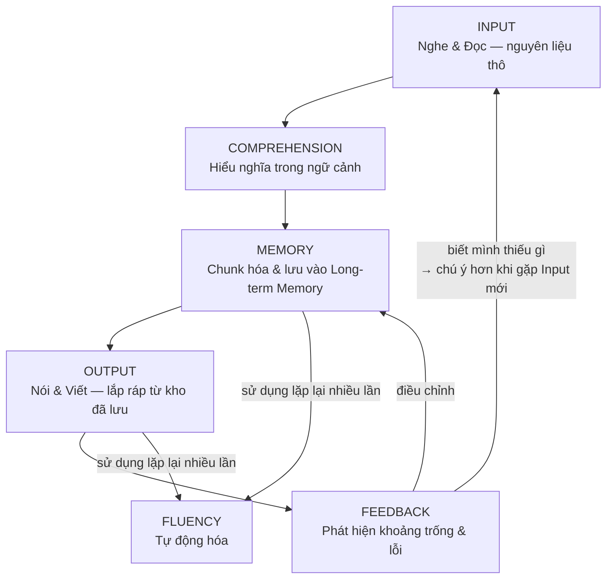

> Chương 01 trả lời "học cái gì", chương 02 trả lời "bộ máy nào xử lý". Chương này lắp tất cả thành một dây chuyền — và cho bạn công cụ chẩn đoán: khi việc học trục trặc, mắt xích nào đang hỏng?

---

## 1. Bài toán người học đang gặp

Người học thường sưu tầm phương pháp như sưu tầm mẹo: hôm nay Shadowing, tuần sau Anki, tháng sau "phản xạ Effortless English", rồi kết luận "chẳng cái nào hiệu quả với mình". Vấn đề không nằm ở phương pháp — vấn đề là dùng phương pháp mà không biết nó **tác động vào mắt xích nào** của quá trình học, nên chọn sai thuốc cho đúng bệnh: người thiếu Input trầm trọng lại đi luyện phản xạ nói; người đã nghe tốt lại tiếp tục cày nghe thay vì luyện Output.

## 2. Dây chuyền học ngôn ngữ

Đi qua từng mắt xích:

### Input — không có nguyên liệu thì không có gì cả

**Input** là toàn bộ tiếng Anh bạn tiếp nhận qua nghe và đọc. Input Hypothesis của Krashen đặt nó ở trung tâm: ta thụ đắc ngôn ngữ khi hiểu được thông điệp ở mức **hơi cao hơn trình độ hiện tại một chút** (công thức nổi tiếng *i+1*). Trực giác của công thức: quá dễ (i) thì không có gì mới để học; quá khó (i+5) thì vượt Cognitive Load, não bỏ cuộc. Vùng học nằm ở mép ngoài vùng hiểu.

Krashen bị phê bình vì cho rằng *chỉ cần* Input là đủ — nghiên cứu sau này (đặc biệt Swain, xem Output bên dưới) chỉ ra Input cần nhưng không đủ. Tuy nhiên phần *cần* thì không ai bác bỏ: **không có con đường nào đến trình độ cao mà thiếu lượng Input lớn.** Mọi thứ bạn nói ra được, trước đó phải từng đi vào.

### Comprehension — Input chưa hiểu là tiếng ồn

Nghe 100 giờ radio tiếng Anh mà không hiểu gì thì não không học được gì — nó chỉ là tiếng ồn nền. Điều kiện để Input trở thành nguyên liệu học: (a) **hiểu được đại ý** nhờ ngữ cảnh, kiến thức nền, hình ảnh; và (b) **có sự chú ý**. Noticing Hypothesis (Schmidt) bổ sung điểm quan trọng: để thụ đắc một cấu trúc, người học phải *nhận ra* nó trong Input — nghe hiểu ý chung chưa đủ, phải có khoảnh khắc "à, họ nói *'I've been there'* chứ không phải *'I was there'*". Đây là chỗ tư duy phân tích của người lớn thành lợi thế: bạn có thể chủ động rèn thói quen nhận ra (noticing) thay vì chờ nó tự xảy ra.

### Memory — hiểu rồi phải giữ được

Hiểu xong mà không củng cố thì 48 giờ sau còn lại rất ít (đường cong quên lãng, chương 02). Mắt xích này chạy bằng Active Recall + Spaced Repetition + Chunking. Đây là mắt xích *có thể hệ thống hóa tốt nhất* — công cụ (flashcard, sổ tay ôn tập) hỗ trợ được nhiều nhất.

### Output — nói/viết không chỉ là kết quả, mà là phương pháp học

Output Hypothesis (Swain) ra đời từ quan sát học sinh Canada học nhúng (immersion) tiếng Pháp: nghe hiểu xuất sắc sau nhiều năm, nhưng nói vẫn đầy lỗi. Kết luận: Output có vai trò học tập riêng mà Input không thay được, vì khi **buộc phải sản xuất**, bạn:

1. **Phát hiện lỗ hổng (noticing the gap):** nghe hiểu chỉ cần nghĩa; nói buộc phải huy động dạng chính xác — và ngay lập tức lộ ra bạn không biết "quyết định" đi với *make* hay *do*.
2. **Kiểm định giả thuyết:** mỗi câu nói ra là một giả thuyết về tiếng Anh, được xác nhận hoặc bác bỏ qua phản ứng người nghe.
3. **Chuyển chế độ xử lý:** từ xử lý nghĩa (đủ để hiểu) sang xử lý cú pháp (cần để nói) — chính quá trình proceduralization của chương 02.

### Feedback — không có phản hồi thì lỗi hóa thạch

Luyện tập không có phản hồi thì không tiến bộ — chỉ **củng cố hiện trạng**, kể cả lỗi. Hiện tượng lỗi lặp mãi thành cố định gọi là **fossilization** (hóa thạch): nói sai *"He don't know"* 1000 lần không có ai sửa thì lần thứ 1001 vẫn sai, và càng khó sửa hơn. Feedback có nhiều nguồn, không nhất thiết là giáo viên: người đối thoại (nét mặt bối rối = feedback), so bản ghi âm của mình với bản gốc, công cụ chấm viết, và chính Input (nghe nhiều sẽ tự thấy câu mình từng nói "nghe sai sai").

### Fluency — sản phẩm của tần suất, không phải kiến thức

**Fluency** là khi toàn bộ dây chuyền chạy tự động: hiểu ngay khi nghe, bật ra ngay khi cần nói, Working Memory rảnh để lo *nội dung* thay vì *hình thức*. Nó là Automaticity (chương 02) áp lên toàn hệ thống — và chỉ đến từ số lần vòng lặp trên được chạy, không đến từ việc hiểu thêm lý thuyết. Kể cả việc đọc tài liệu này cũng không tăng fluency của bạn — nó chỉ giúp bạn *thiết kế* việc luyện tập đúng hơn.

## 3. Giải pháp hiện tại có hạn chế gì? — Các trường phái nhìn qua mô hình

| Trường phái | Mắt xích được chăm | Mắt xích bị bỏ | Hệ quả điển hình |
|---|---|---|---|
| Trường học truyền thống (grammar-translation) | Memory (dạng quy tắc) | Input thật, Output nói, Feedback giao tiếp | Giỏi bài tập, câm khi hội thoại |
| "Chỉ cần nghe nhiều" (Input thuần túy) | Input, Comprehension | Output, Feedback | Hiểu tốt, nói mãi không lên |
| Luyện giao tiếp sớm, bỏ nền | Output | Input, Memory | Nói nhanh nhưng nghèo nàn, lỗi hóa thạch |
| Flashcard cực đoan | Memory | Input ngữ cảnh, Output | Biết 5000 từ, không dùng nổi 500 |

Không trường phái nào *sai* — mỗi cái đúng ở mắt xích nó phục vụ. Sai lầm là tưởng một mắt xích là toàn bộ dây chuyền.

## 4. Nguyên lý cốt lõi

1. **Học ngôn ngữ là một vòng lặp, không phải đường thẳng.** Không có chuyện "học xong Input rồi mới đến Output" — các mắt xích chạy song song, nuôi nhau.
2. **Tốc độ cả dây chuyền bằng tốc độ mắt xích chậm nhất.** Đầu tư thêm vào mắt xích đã mạnh cho lợi suất giảm dần; chẩn đoán đúng mắt xích yếu là kỹ năng meta quan trọng nhất.
3. **Tỉ trọng giữa các mắt xích thay đổi theo giai đoạn** — người mới cần nghiêng mạnh về Input; người trung cấp cần đẩy Output và Feedback.

## 5. Cách áp dụng — tự chẩn đoán mắt xích yếu

Dùng bảng sau như bác sĩ dùng triệu chứng:

| Triệu chứng | Mắt xích hỏng | Thuốc (chương chi tiết) |
|---|---|---|
| Nghe không ra từ nào, kể cả từ đã biết | Input quá ít / sai tầng âm thanh | Ch. 05, 08 |
| Nghe ra từ nhưng không kịp hiểu câu | Thiếu chunk — Memory | Ch. 02, 07 |
| Hiểu tốt nhưng không nói được | Thiếu Output | Ch. 09 |
| Nói được nhưng sai mãi một kiểu lỗi | Thiếu Feedback | Ch. 09, 11 |
| Nói đúng nhưng chậm, mệt | Thiếu Automaticity — chưa đủ vòng lặp | Ch. 02, 09 |
| Học trước quên sau | Memory không có hệ thống ôn | Ch. 02 |

Quy trình 4 bước: (1) Ghi lại một tuần học — bạn thực sự dành bao nhiêu phút cho mỗi mắt xích? (2) Đối chiếu triệu chứng với bảng trên. (3) Chuyển 50% thời gian sang mắt xích yếu nhất trong 4–6 tuần. (4) Đánh giá lại.

## 6. Ví dụ minh họa

**Linh** — 5 năm học tiếng Anh, đọc tài liệu tốt, nghe TED hiểu ~70%, nhưng trong meeting với khách nước ngoài chỉ im lặng. Tự chẩn đoán theo bảng: Input ổn (đọc + nghe đều khá), Comprehension ổn, nhưng thời gian Output thật gần như **bằng 0** — và vì không nói nên cũng không có Feedback. Linh không cần "học thêm tiếng Anh"; Linh cần chuyển 50% thời gian sang nói: self-talk hằng ngày, 2 buổi hội thoại/tuần, ghi âm và nghe lại. Sau 3 tháng, cùng một vốn tiếng Anh đó bắt đầu *dùng được* — vì mắt xích nghẽn đã được thông, không phải vì kho kiến thức to lên.

## 7. Sai lầm phổ biến

- Nhảy phương pháp liên tục mà không chẩn đoán → như uống thuốc ngẫu nhiên, khỏi bệnh cũng không biết vì sao.
- Đầu tư mãi vào mắt xích mình *thích* (thường là mắt xích đã mạnh, vì nó dễ chịu) → lợi suất giảm dần trong khi nút nghẽn còn nguyên.
- Chờ "đủ giỏi mới nói" → Output bị hoãn vô hạn; trong khi chính Output mới lộ ra cần học gì tiếp.
- Coi Fluency là mục tiêu học trực tiếp → Fluency không học được, nó *kết tủa* từ số vòng lặp.

## 8. Trade-off và giới hạn

- Mô hình là bản đồ giản lược; thực tế các mắt xích chồng lấn (nghe một hội thoại vừa là Input vừa là Feedback cho câu bạn vừa nói).
- Chẩn đoán bản thân có điểm mù — thỉnh thoảng cần người ngoài (giáo viên, bạn học khá hơn) nhìn hộ.
- Cân bằng mọi mắt xích *cùng lúc* với người chỉ có 30 phút/ngày là bất khả — phải chấp nhận xoay vòng trọng tâm theo tuần/tháng (chương 14 có phương án cụ thể).

## 9. Best Practice

- Mỗi 4–6 tuần, chạy lại quy trình tự chẩn đoán ở mục 5. Nút nghẽn di chuyển khi bạn tiến bộ.
- Thiết kế hoạt động chạm nhiều mắt xích cùng lúc khi quỹ thời gian hẹp: ví dụ Shadowing = Input + Comprehension + Output-âm thanh + Feedback (so với bản gốc) trong một hoạt động.
- Giữ một tỉ lệ sàn: dù trọng tâm là gì, không mắt xích nào về 0 quá 2 tuần.
- Trước khi thử phương pháp mới, trả lời được: "nó tác động mắt xích nào, và đó có phải mắt xích tôi đang yếu không?"

## 10. Tóm tắt những điều cần nhớ

- Dây chuyền: **Input → Comprehension → Memory → Output → Feedback → (lặp lại nhiều lần) → Fluency.**
- Input là **cần nhưng không đủ**; Output có chức năng học riêng (phát hiện lỗ hổng, kiểm định giả thuyết); Feedback chống lỗi hóa thạch.
- Trình độ của bạn bị chặn bởi **mắt xích yếu nhất**, không phải mắt xích mạnh nhất.
- Kỹ năng meta số một của người tự học: **chẩn đoán đúng mắt xích nghẽn** rồi dồn lực vào đó — thay vì sưu tầm phương pháp.

---

*Tiếp theo: [Chương 04 — Bốn kỹ năng](/handbook/04-bon-ky-nang) — ánh xạ mô hình này lên Listening, Speaking, Reading, Writing.*
