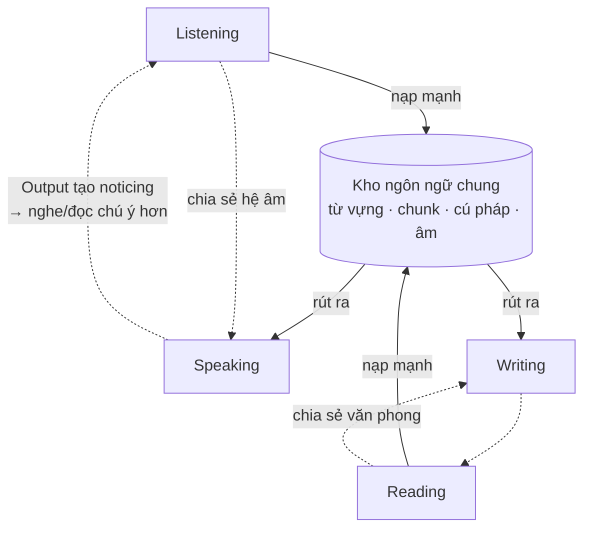

> Listening, Speaking, Reading, Writing thường được dạy như bốn môn riêng. Về mặt nhận thức, chúng là bốn cửa ngõ của **cùng một hệ ngôn ngữ trong não** — và cách chúng nuôi nhau quyết định bạn nên ưu tiên gì, khi nào.

---

## 1. Bài toán người học đang gặp

"Em nên học nghe trước hay nói trước?", "đọc nhiều có giúp nói không?", "có cần luyện viết không nếu chỉ muốn giao tiếp?" — người học liên tục phải quyết định phân bổ thời gian giữa bốn kỹ năng mà không có khung nào để quyết định. Kết quả phổ biến là **học lệch không chủ đích**: học theo môn mình thích hoặc môn được thi, rồi ngạc nhiên khi kỹ năng cần nhất lại yếu nhất.

## 2. Vì sao? — Cấu trúc quan hệ giữa bốn kỹ năng

Bốn kỹ năng nằm trên hai trục:

|  | **Tiếp nhận (Input)** | **Sản xuất (Output)** |
|---|---|---|
| **Âm thanh** (thời gian thực) | Listening | Speaking |
| **Chữ viết** (không thời gian thực) | Reading | Writing |

Hai trục này cho ba hệ quả quan trọng:

**Thứ nhất — Input nuôi Output cùng kênh mạnh nhất.** Kho ngôn ngữ bạn rút ra khi nói được nạp chủ yếu từ nghe; kho khi viết được nạp chủ yếu từ đọc. Văn nói và văn viết là hai "phương ngữ" khác nhau (*gonna, you know, chunk ngắn* vs. *câu phức, từ Latin gốc*). Đây là lý do người đọc nhiều viết khá lên rõ rệt nhưng nói không khá tương ứng — và ngược lại.

**Thứ hai — kỹ năng âm thanh bị ràng buộc thời gian thực, kỹ năng chữ viết thì không.** Nghe không cho phép "nghe lại chậm chậm"; nói không cho phép soạn nháp. Vì vậy Listening/Speaking đòi hỏi **Automaticity cao hơn hẳn** Reading/Writing ở cùng nội dung. Đây là lý do một người đọc hiểu câu *"I should've known better"* trong 1 giây nhưng không nghe ra nó trong hội thoại (được phát âm thành */aɪ ʃʊdəv noʊn/* dính liền) — cùng kiến thức, khác yêu cầu tốc độ xử lý.

**Thứ ba — cả bốn rút từ một kho chung.** Từ vựng, chunk, cú pháp nằm trong một hệ duy nhất ở Long-term Memory. Luyện kỹ năng nào cũng bồi cho kho chung đó — nên không có nỗ lực nào "vô ích cho kỹ năng khác", chỉ có hiệu suất chuyển đổi khác nhau:

## 3. Giải pháp hiện tại có hạn chế gì? — Các kiểu học lệch

| Kiểu lệch | Chân dung điển hình | Hậu quả |
|---|---|---|
| Đọc-nặng (phổ biến nhất ở VN) | Học qua sách, đề thi; đọc B2, nghe A2 | "Phát âm tưởng tượng": biết từ qua mặt chữ với âm tự chế → không nghe ra từ mình "biết"; nói bị người nghe không hiểu |
| Nghe-nặng thụ động | Cày phim/podcast nhiều năm, không nói không đọc | Hiểu tốt, Output nghèo; từ vựng học thuật yếu |
| Nói-sớm không nền | Lao vào club tiếng Anh từ tuần đầu | Fluent trong nghèo nàn; lỗi hóa thạch vì Output vượt xa Input |
| Viết-thi | Luyện essay IELTS theo template | Viết "đúng khung" nhưng không giao tiếp văn bản thật được (email, chat) |

Điểm chung: mỗi kiểu lệch đều **tự khóa trần** của chính kỹ năng được luyện — vì kỹ năng đó thiếu nguồn nuôi từ kỹ năng bổ trợ. Người nói-sớm không tiến vì thiếu Input mới để nói hay hơn; người đọc-nặng nghe mãi không lên vì hệ âm sai từ gốc.

## 4. Nguyên lý cốt lõi

1. **Input đi trước Output, âm thanh đi trước chữ viết** — ở giai đoạn đầu. Đây là trật tự thụ đắc tự nhiên và cũng là trật tự hiệu quả cho người học lại từ đầu.
2. **Tỉ trọng bốn kỹ năng là biến số theo giai đoạn và mục tiêu,** không phải hằng số 25%×4.
3. **Kỹ năng thời gian thực cần luyện vượt mức (overlearning):** nội dung muốn dùng được khi nghe-nói phải quen thuộc hơn nhiều so với mức "hiểu khi đọc".

## 5. Cách áp dụng — tỉ trọng gợi ý theo giai đoạn

Dành cho mục tiêu giao tiếp tổng quát (điều chỉnh theo mục tiêu riêng ở chương 12):

| Giai đoạn | Listening | Speaking | Reading | Writing | Lý do |
|---|---|---|---|---|---|
| Mới bắt đầu / mất gốc (0–6 tháng) | **50%** | 15% (nhại, đọc to) | 30% | 5% | Dựng hệ âm đúng + nạp Input; Output chủ yếu là bắt chước |
| Sơ-trung cấp (6–18 tháng) | 35% | **25%** | 30% | 10% | Bắt đầu Output thật; Input vẫn là nền |
| Trung cấp lên cao | 30% | **30%** | 25% | 15% | Output + Feedback thành động cơ chính; Input để mở rộng chiều sâu |

Ba quy tắc khi áp dụng: (1) "Speaking" giai đoạn đầu không có nghĩa là hội thoại tự do — nhại theo audio (chương 05, 08) đã là luyện cơ quan phát âm hợp lệ; (2) Reading luôn đi kèm audio khi có thể (audiobook + sách, phụ đề + phim) để chữ và âm khớp nhau từ đầu; (3) không kỹ năng nào về 0 — tỉ trọng thấp nhất vẫn là vài phút mỗi tuần.

## 6. Ví dụ minh họa

**Trường hợp "biết mà không nghe ra":** Hùng đọc hiểu từ *comfortable* từ năm lớp 8, trong đầu đọc nó là "com-pho-tê-bồ" (4 âm tiết đều nhau, kiểu Việt). Người bản xứ nói */ˈkʌmf.tə.bəl/* — 3 âm tiết, trọng âm đầu, nuốt gần hết phần giữa. Với hệ nghe của Hùng, đây là một từ *hoàn toàn khác*. Hùng "biết" từ này trong kho chữ viết nhưng không sở hữu nó trong kho âm thanh — hai kho không tự đồng bộ. Đây là hậu quả điển hình của học đọc-nặng, và là lý do tỉ trọng nghe giai đoạn đầu phải áp đảo: **xây kho âm đúng trước khi kho chữ kịp làm hỏng nó.**

**Trường hợp chuyển giao thành công:** Trang luyện nói chủ đề công việc bằng cách *đọc to* các đoạn hội thoại mẫu (Reading nuôi Speaking qua kênh âm thanh), rồi nghe podcast cùng chủ đề (Listening nạp chunk hội thoại), rồi self-talk tổng hợp lại. Ba kỹ năng xoay quanh một chủ đề — kho chung được nạp và rút liên tục, hiệu suất cao hơn hẳn luyện ba kỹ năng với ba chủ đề rời.

## 7. Sai lầm phổ biến

- Chia đều 25% cho mỗi kỹ năng ở mọi giai đoạn — nghe có vẻ "cân bằng" nhưng bỏ qua trật tự thụ đắc.
- Luyện kỹ năng nào chỉ biết kỹ năng đó — bỏ phí hiệu ứng kho chung (một chủ đề nên chạy qua nhiều kỹ năng).
- Đánh giá trình độ bằng kỹ năng mạnh nhất ("em đọc được paper mà") — trong khi giao tiếp đòi kỹ năng thời gian thực.
- Trì hoãn nghe "vì chưa đủ từ vựng" — ngược logic: nghe chính là cách nạp từ vựng dạng dùng được.

## 8. Trade-off và giới hạn

- Tỉ trọng trên là điểm xuất phát, không phải chân lý: lập trình viên cần đọc tài liệu có thể nghiêng hẳn về Reading (chương 12) — học lệch **có chủ đích** là hợp lệ; học lệch **không biết mình lệch** mới là vấn đề.
- Đồng bộ âm-chữ (nghe kèm đọc) tăng hiệu quả nhưng cũng tăng Cognitive Load với người mới — nếu quá tải, tách ra: nghe trước, đọc sau.
- Bảng chẩn đoán bằng tỉ trọng thời gian không đo được *chất lượng* giờ học — 30 phút nghe chủ động đáng giá hơn 3 giờ nghe làm nền.

## 9. Best Practice

- Chạy một chủ đề qua chuỗi kỹ năng: nghe → đọc transcript → nói lại → viết tóm tắt. Kho chung được kích hoạt bốn lần từ bốn hướng.
- Mỗi từ/chunk mới đều phải đi qua tai và miệng ít nhất một lần — kể cả khi bạn học nó từ sách.
- Kiểm kê thời gian học theo 4 ô mỗi tháng một lần; so với bảng tỉ trọng của giai đoạn và mục tiêu của bạn.
- Khi thiếu thời gian, ưu tiên cắt theo nguyên tắc: giữ Input âm thanh và Output nói, co Reading/Writing (với mục tiêu giao tiếp) — hoặc ngược lại với mục tiêu đọc tài liệu.

## 10. Tóm tắt những điều cần nhớ

- Bốn kỹ năng = bốn cửa ngõ của **một kho ngôn ngữ chung**: 2 chiều (nhận/sản xuất) × 2 kênh (âm/chữ).
- **Nghe nuôi nói, đọc nuôi viết** — muốn Output kênh nào, phải nạp Input kênh đó.
- Kỹ năng âm thanh bị ràng buộc **thời gian thực** → cần mức tự động hóa cao hơn hẳn → cần luyện vượt mức.
- Tỉ trọng thay đổi theo giai đoạn: đầu nghiêng mạnh về **nghe**; sau tăng dần **nói + feedback**. Học lệch có chủ đích thì được, lệch vô thức thì không.

---

*Tiếp theo: [Chương 05 — Pronunciation](/handbook/05-pronunciation) — vì sao hệ âm là móng của cả nghe lẫn nói.*
