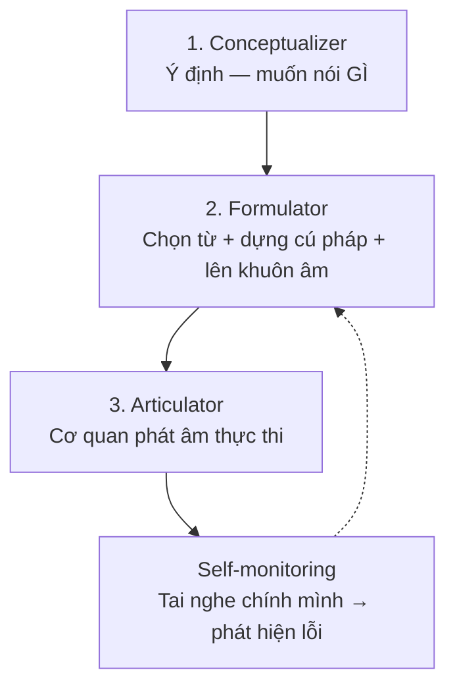

> "Đợi giỏi rồi mới nói" là kế hoạch phổ biến nhất và thất bại chắc chắn nhất — vì nói không phải phần thưởng của việc học, mà là **một phần của việc học**. Chương này giải thích cơ chế của lời nói và cách luyện nó một mình lẫn với người khác.

---

## 1. Bài toán người học đang gặp

- Hiểu tốt, từ vựng khá, nhưng khi cần nói: não trắng xóa, tim đập nhanh, bật ra vài từ rời rạc.
- Nói được nhưng cực chậm — dịch thầm từng câu Việt→Anh trong đầu.
- Nói trôi nhưng quanh quẩn mãi vốn câu cũ, nhiều năm không giàu lên.

Ba chân dung — ba điểm gãy khác nhau trên cùng một dây chuyền sản xuất lời nói.

## 2. Vì sao? — Lời nói được sản xuất thế nào

Mô hình sản xuất lời nói kinh điển (Levelt) chia ba tầng, chạy trong vài trăm mili-giây:

Ở người bản xứ, tầng 2–3 chạy **tự động**, Working Memory chỉ lo tầng 1 (nội dung). Ở người học, cả ba tầng đều đòi xử lý có ý thức → tràn WM ngay lập tức. Ba chân dung ở mục 1 tương ứng ba kiểu nghẽn:

| Chân dung | Điểm gãy | Bản chất |
|---|---|---|
| "Não trắng xóa" | Formulator chưa từng được chạy | Kho toàn kiến thức thụ động; chưa có đường truyền sản xuất; cộng thêm **affective filter** — lo âu chiếm nốt phần WM còn lại |
| "Dịch thầm Việt→Anh" | Formulator chạy qua đường vòng | Ý được dựng bằng cú pháp Việt rồi dịch — chậm gấp nhiều lần và ra câu Việt-hóa |
| "Trôi mà nghèo" | Formulator tự động hóa trên vốn hẹp | Fluency đạt được trên tập chunk nhỏ; thiếu Input mới + thiếu độ khó đẩy trần |

### Fluency vs Accuracy — cuộc giằng co tài nguyên

**Fluency** (trôi chảy: nói liền mạch, ít ngập ngừng) và **Accuracy** (chính xác: đúng ngữ pháp, từ, âm) cạnh tranh nhau trực tiếp trên quỹ Working Memory: dồn WM cho giám sát lỗi thì mất trôi chảy; buông giám sát thì lỗi tăng. Hệ quả thực tiễn quan trọng: **không luyện cả hai cùng lúc trong cùng một hoạt động** — tách buổi luyện fluency (nói liên tục, cấm tự sửa) khỏi buổi luyện accuracy (nói chậm, tự giám sát một lỗi mục tiêu). Trần của cả hai cùng nâng khi Automaticity tăng — nhưng tại mỗi thời điểm, sự đánh đổi là thật.

### Output Hypothesis — vì sao nói là học, không chỉ là dùng

Nhắc lại từ chương 03 (Swain): hành động nói buộc não (a) **phát hiện lỗ hổng** — "mình không biết nói 'thà muộn còn hơn'"; (b) **kiểm định giả thuyết** — nói ra và quan sát phản ứng; (c) **chuyển từ xử lý nghĩa sang xử lý cú pháp**. Thêm Interaction Hypothesis (Long): trong hội thoại, các pha **thương lượng nghĩa** (negotiation of meaning) — người kia hỏi lại, mình diễn đạt lại — chính là những khoảnh khắc học đậm đặc nhất, vì Input lúc đó được "may đo" đúng lỗ hổng vừa lộ ra của bạn.

### Thinking in English — gỡ đường vòng dịch thầm

"Nghĩ bằng tiếng Anh" không phải trạng thái huyền bí — nó đơn giản là **Formulator truy xuất trực tiếp chunk tiếng Anh từ ý định, bỏ trạm trung chuyển tiếng Việt**. Nó không đến từ ý chí ("từ mai mình sẽ nghĩ bằng tiếng Anh!") mà đến từ: kho chunk đủ lớn (chương 07) + số lần sản xuất đủ nhiều để đường truyền trực tiếp mạnh hơn đường vòng. Có thể mồi nó một cách cơ học: bắt đầu bằng việc *gọi tên thầm* đồ vật, hành động quanh mình bằng tiếng Anh — ép truy xuất trực tiếp ở mức khó thấp nhất, rồi nâng dần lên cụm, câu, chuỗi suy nghĩ.

## 3. Giải pháp hiện tại có hạn chế gì?

| Giải pháp | Hạn chế |
|---|---|
| "Đợi đủ giỏi rồi nói" | Vòng luẩn quẩn: không nói → không bao giờ "đủ" — vì chính nói mới tạo năng lực nói |
| Club/lớp giao tiếp mỗi tuần 1 buổi | Tần suất quá thấp cho Automaticity; thường nói với người cùng sai → Input lỗi, Feedback ít |
| Học thuộc "mẫu câu giao tiếp" | Chunk không có ngữ cảnh + không luyện lắp ráp linh hoạt → gặp tình huống chệch kịch bản là sập |
| App chấm phát âm từng câu | Tốt cho âm; không luyện Conceptualizer–Formulator (tạo ý, tạo câu) |

## 4. Nguyên lý cốt lõi

1. **Nói là kỹ năng sản xuất — chỉ tăng bằng số lần sản xuất.** Nghe/đọc thêm không thay được (chương 03, 04).
2. **Tách mục tiêu fluency và accuracy** theo buổi; đo tiến bộ riêng từng cái.
3. **Phần lớn giờ luyện nói không cần người đối thoại** — Self-talk, kể lại, ghi âm phủ được tầng Formulator–Articulator; hội thoại thật để dành cho thứ chỉ nó có: tính bất định và thương lượng nghĩa.
4. **Lo âu là một phần của bài toán, không phải lỗi tính cách:** affective filter (Krashen) — lo âu cao chặn cả Input lẫn Output. Thiết kế môi trường ít đe dọa (nói một mình, nói với AI, nhóm nhỏ quen) là chiến lược hợp lệ, không phải trốn tránh.

## 5. Cách áp dụng từng bước — thang luyện nói một mình lên hội thoại

1. **Bậc 1 — Nhại có khuôn (đã có từ ch.05, 08):** đọc to, shadowing. Luyện Articulator, chưa cần tạo câu.
2. **Bậc 2 — Kể lại (retelling):** nghe/đọc một đoạn ngắn → úp tài liệu → kể lại nội dung thành lời, to, bằng từ của mình. Bài tập bản lề: có nội dung sẵn (Conceptualizer nhẹ) để dồn sức cho Formulator.
3. **Bậc 3 — Self-talk:** mô tả việc đang làm (*"OK, I'm making coffee... where's the filter?"*), kể lại ngày của mình mỗi tối 3–5 phút, phát biểu ý kiến về video vừa xem. Bí từ → ghi lại → tra sau → đưa vào SRS (mỗi lần bí từ là một lỗ hổng được phát hiện — đúng chức năng của Output).
4. **Bậc 4 — Độc thoại có áp lực (4/3/2):** nói về một chủ đề 4 phút → cùng nội dung trong 3 phút → rồi 2 phút. Lặp nội dung + ép thời gian = kỹ thuật kinh điển tăng fluency có kiểm chứng nghiên cứu (Nation).
5. **Bậc 5 — Ghi âm & tự Feedback:** ghi âm bậc 3–4, nghe lại sau 1 ngày, tự bắt 3 lỗi + 3 chỗ diễn đạt vụng → tra cách nói hay hơn → nói lại lần hai. Vòng Feedback không cần giáo viên.
6. **Bậc 6 — Hội thoại thật:** bạn học, giáo viên online, đồng nghiệp, AI đàm thoại. Vào bậc này *song song* từ khi ở bậc 3 — thang không phải tuần tự cứng; nhưng người có nền bậc 2–5 khai thác hội thoại hiệu quả hơn hẳn vì không cháy WM cho việc lắp câu cơ bản.

## 6. Ví dụ minh họa

**Kỹ thuật 4/3/2 trong thực tế.** Chủ đề: "dự án đang làm ở công ty".

- Vòng 4 phút: ngập ngừng nhiều, bí từ *"deadline bị dời"* → nói vòng *"the deadline was... moved to next month"*. Ghi chú lại.
- Tra sau vòng 1: *push back the deadline*. Nhẩm 2 lần.
- Vòng 3 phút: cùng nội dung, ít ngập ngừng hơn (nội dung đã có sẵn trong đầu — Conceptualizer rảnh), dùng luôn *"we had to push back the deadline"*.
- Vòng 2 phút: buộc nén → chỉ giữ ý chính, các chunk vừa dùng 2 lần bật ra gần như tự động.

12 phút, một mình, không cần ai — và chạm đủ: Output, phát hiện lỗ hổng, học chunk mới trong ngữ cảnh nhu cầu thật (loại dính nhất), lặp lại tăng automaticity, và một mẩu fluency đo được (số từ/phút tăng qua từng vòng).

## 7. Sai lầm phổ biến

- **Sợ nói sai → không nói:** lỗi khi nói là *dữ liệu học* (giả thuyết bị bác bỏ), không phải thất bại. Người nói 1000 câu sai rồi được sửa vượt xa người im lặng chờ hoàn hảo — và fossilization phòng được bằng Feedback, không phải bằng im lặng.
- **Soạn sẵn kịch bản rồi đọc thuộc:** luyện trí nhớ, không luyện Formulator; gặp câu hỏi ngoài kịch bản là sập. (Chuẩn bị *ý* và *chunk* thì tốt; chuẩn bị *nguyên văn* thì phản tác dụng.)
- **Chỉ nói trong đầu, không nói to:** bỏ tầng Articulator và self-monitoring bằng tai — hai tầng chỉ luyện được khi âm thanh thật phát ra.
- **Hội thoại xong là xong:** không note lại chỗ bí, không nghe lại — vứt đi một nửa giá trị học của buổi nói.
- **Đánh giá mình qua một buổi nói tệ:** năng lực nói dao động mạnh theo mệt mỏi, chủ đề, tâm lý; xu hướng theo tháng mới là tín hiệu thật.

## 8. Trade-off và giới hạn

- Self-talk và luyện một mình **không có thương lượng nghĩa và tính bất định** — đủ để xây Formulator nhưng không thay được hội thoại; ngược lại hội thoại thiếu nền luyện riêng thì tiến chậm và mệt. Cần cả hai, tỉ lệ tùy giai đoạn.
- Luyện fluency trên vốn hẹp có rủi ro "trôi mà nghèo" — phải bơm Input mới liên tục (chương 08) và định kỳ ép độ khó (chủ đề lạ, ngữ cảnh trang trọng).
- Nói với AI: sẵn sàng 24/7, không phán xét, Feedback tức thì — nhưng người thật kém kiên nhẫn hơn, nói nhanh hơn và khó đoán hơn; đừng để AI là 100% hội thoại của bạn.
- Kỹ thuật 4/3/2 tăng fluency nhưng nghiên cứu cũng ghi nhận accuracy có thể giảm nhẹ trong bài — đúng như trade-off WM dự đoán; cân bằng bằng buổi accuracy riêng.

## 9. Best Practice

- **Nói to hằng ngày dù chỉ 5 phút** — tần suất thắng thời lượng tuyệt đối với Automaticity.
- Chu trình tuần cân đối: 3–4 buổi self-talk/retelling ngắn + 1–2 buổi 4/3/2 có ghi âm + 1–2 hội thoại thật + 1 lần nghe lại ghi âm để rút lỗi mục tiêu tuần sau.
- Nuôi "kho cứu hộ hội thoại" (communication strategies): *"How do you say...?", "What I mean is...", "Sorry, let me rephrase that"* — các chunk giữ cho hội thoại sống khi bí, biến mọi sự cố thành cơ hội học.
- Mỗi buổi hội thoại đặt **một** mục tiêu duy nhất: hôm nay dùng 3 chunk mới / hôm nay sạch lỗi "he don't" / hôm nay nói không ngừng quá 3 giây. Một mục tiêu = WM kham được.

## 10. Tóm tắt những điều cần nhớ

- Lời nói = **Conceptualizer → Formulator → Articulator**; người học nghẽn chủ yếu ở Formulator — và nó chỉ được xây bằng **số lần sản xuất thật**, không bằng nghe thêm.
- **Fluency và Accuracy cạnh tranh Working Memory** — luyện tách buổi, đo tách chỉ số.
- Nói là **phương pháp học** (phát hiện lỗ hổng, kiểm định giả thuyết, thương lượng nghĩa), không phải phần thưởng sau khi học xong. "Đợi giỏi mới nói" là nghịch lý tự khóa.
- Phần lớn giờ luyện nói làm được **một mình**: kể lại → self-talk → 4/3/2 → ghi âm tự sửa. Hội thoại thật là tầng trên cùng, không phải cánh cửa duy nhất.
- "Nghĩ bằng tiếng Anh" = truy xuất chunk trực tiếp — sản phẩm của kho chunk lớn + sản xuất nhiều, không phải của ý chí.

---

*Tiếp theo: [Chương 10 — Reading](/handbook/10-reading) — cỗ máy nạp từ vựng mạnh nhất và cách dùng nó đúng.*
